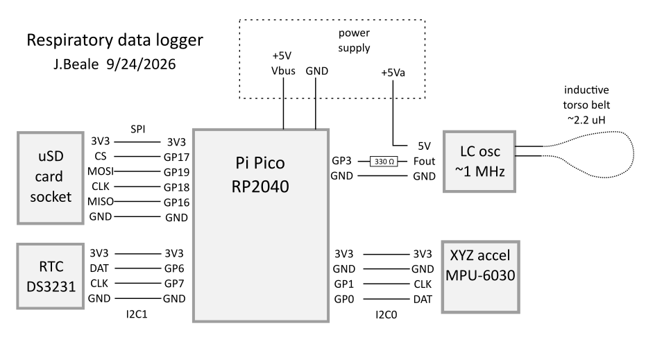

Record and log data useful in analyzing breathing and body posture.

```
Pico Frequency Counter + MPU-6050 Logger v1.0.3
RTC time: 2026-09-24 21:37:33 UTC
Initializing SD card...
File: 09242137.csv (new)
MPU-6050 initialized
Ready to measure (250 ms gate windows)
Waiting for first frequency measurement...
Initial frequency: 965186.58 Hz
0.25 s: freq= 965207.44 Hz, delta=  +20.88 Hz, ax=0.7254, ay=0.1027, az=0.6840, T=23.84 C
0.50 s: freq= 965232.23 Hz, delta=  +24.81 Hz, ax=0.7264, ay=0.1027, az=0.6839, T=23.86 C
0.75 s: freq= 965300.97 Hz, delta=  +68.75 Hz, ax=0.7266, ay=0.1021, az=0.6852, T=23.88 C
1.00 s: freq= 965553.22 Hz, delta= +252.25 Hz, ax=0.7262, ay=0.1025, az=0.6848, T=23.89 C
1.25 s: freq= 965862.21 Hz, delta= +308.94 Hz, ax=0.7264, ay=0.1027, az=0.6842, T=23.91 C
1.50 s: freq= 966107.01 Hz, delta= +244.81 Hz, ax=0.7266, ay=0.1020, az=0.6837, T=23.92 C
1.75 s: freq= 966310.76 Hz, delta= +203.75 Hz, ax=0.7265, ay=0.1023, az=0.6844, T=23.93 C
2.00 s: freq= 966477.77 Hz, delta= +167.00 Hz, ax=0.7262, ay=0.1030, az=0.6843, T=23.95 C
2.25 s: freq= 966522.21 Hz, delta=  +44.44 Hz, ax=0.7265, ay=0.1023, az=0.6838, T=23.95 C
2.50 s: freq= 966564.41 Hz, delta=  +42.25 Hz, ax=0.7268, ay=0.1026, az=0.6848, T=23.96 C
```


